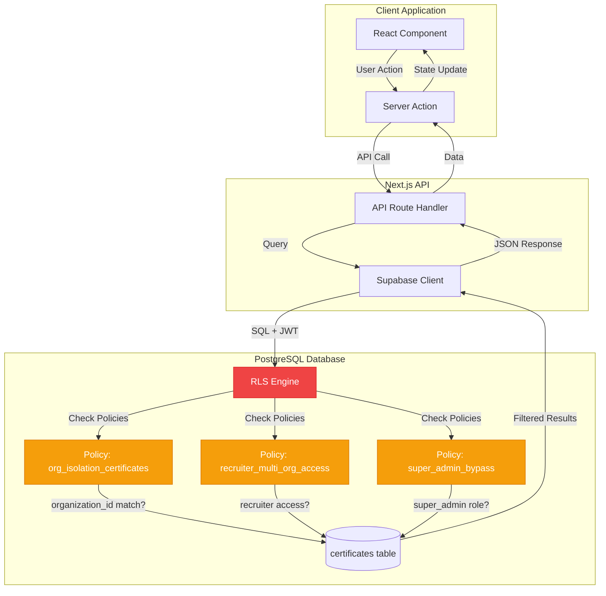

### 📊 Database Query Flow (RLS in Action)

```mermaid
graph TB
    subgraph Client["Client Application"]
        UI[React Component]
        Action[Server Action]
    end

    subgraph Server["Next.js API"]
        Route[API Route Handler]
        Supabase[Supabase Client]
    end

    subgraph Database["PostgreSQL Database"]
        RLS[RLS Engine]
        Policy1[Policy: org_isolation_certificates]
        Policy2[Policy: recruiter_multi_org_access]
        Policy3[Policy: super_admin_bypass]
        Table[(certificates table)]
    end

    UI -->|User Action| Action
    Action -->|API Call| Route
    Route -->|Query| Supabase
    Supabase -->|SQL + JWT| RLS
    
    RLS -->|Check Policies| Policy1
    RLS -->|Check Policies| Policy2
    RLS -->|Check Policies| Policy3
    
    Policy1 -->|organization_id match?| Table
    Policy2 -->|recruiter access?| Table
    Policy3 -->|super_admin role?| Table
    
    Table -->|Filtered Results| Supabase
    Supabase -->|JSON Response| Route
    Route -->|Data| Action
    Action -->|State Update| UI

    style RLS fill:#ef4444,stroke:#dc2626,color:#fff
    style Policy1 fill:#f59e0b,stroke:#d97706,color:#fff
    style Policy2 fill:#f59e0b,stroke:#d97706,color:#fff
    style Policy3 fill:#f59e0b,stroke:#d97706,color:#fff
```
