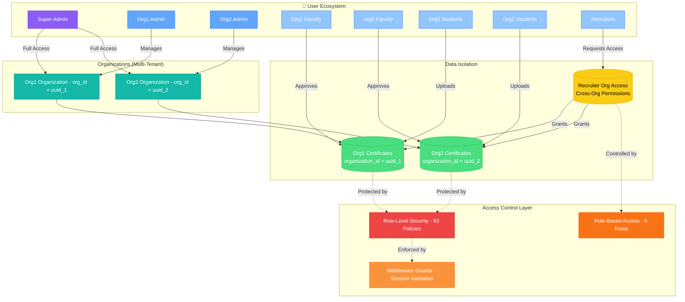

### 🏗️ Multi-Organization Architecture

```mermaid
graph TD
    %% ================= USERS =================
    subgraph Users["👥 User Ecosystem"]
        SU[Super Admin ]
        A1[Org1 Admin]
        A2[Org2 Admin]
        F1[Org1 Faculty]
        F2[org2 Faculty]
        S1[Org1 Students]
        S2[Org2 Students]
        R[Recruiters]
    end

    %% ================= ORGANIZATIONS =================
    subgraph Orgs["Organizations (Multi-Tenant)"]
        O1[Org1 Organization - org_id = uuid_1]
        O2[Org2 Organization - org_id = uuid_2]
    end

    %% ================= DATA =================
    subgraph Data["Data Isolation"]
        D1[(Org1 Certificates\norganization_id = uuid_1)]
        D2[(Org2 Certificates\norganization_id = uuid_2)]
        RA[(Recruiter Org Access\nCross-Org Permissions)]
    end

    %% ================= ACCESS =================
    subgraph Access["Access Control Layer"]
        RLS[Row-Level Security - 83 Policies]
        RBAC[Role-Based Access - 5 Roles]
        MW[Middleware Guards - Session Validation]
    end

    %% ================= RELATIONSHIPS =================
    SU -->|Full Access| O1
    SU -->|Full Access| O2
    A1 -->|Manages| O1
    A2 -->|Manages| O2
    F1 -->|Approves| D1
    F2 -->|Approves| D2
    S1 -->|Uploads| D1
    S2 -->|Uploads| D2
    R -->|Requests Access| RA
    RA -->|Grants| D1
    RA -->|Grants| D2
    O1 --> D1
    O2 --> D2
    D1 -. Protected by .-> RLS
    D2 -. Protected by .-> RLS
    RA -. Controlled by .-> RBAC
    RLS -. Enforced by .-> MW

    %% ================= STYLES (GitHub-Safe: no commas) =================
    style SU fill:#8b5cf6,stroke:#7c3aed,color:#fff

    style A1 fill:#60a5fa,stroke:#3b82f6,color:#fff
    style A2 fill:#60a5fa,stroke:#3b82f6,color:#fff

    style F1 fill:#93c5fd,stroke:#3b82f6,color:#fff
    style F2 fill:#93c5fd,stroke:#3b82f6,color:#fff
    style S1 fill:#93c5fd,stroke:#3b82f6,color:#fff
    style S2 fill:#93c5fd,stroke:#3b82f6,color:#fff
    style R fill:#93c5fd,stroke:#3b82f6,color:#fff

    style O1 fill:#14b8a6,stroke:#0d9488,color:#fff
    style O2 fill:#14b8a6,stroke:#0d9488,color:#fff

    style D1 fill:#4ade80,stroke:#22c55e,color:#fff
    style D2 fill:#4ade80,stroke:#22c55e,color:#fff
    style RA fill:#facc15,stroke:#eab308,color:#000

    style RLS fill:#ef4444,stroke:#dc2626,color:#fff
    style RBAC fill:#f97316,stroke:#ea580c,color:#fff
    style MW fill:#fb923c,stroke:#f97316,color:#fff


```
