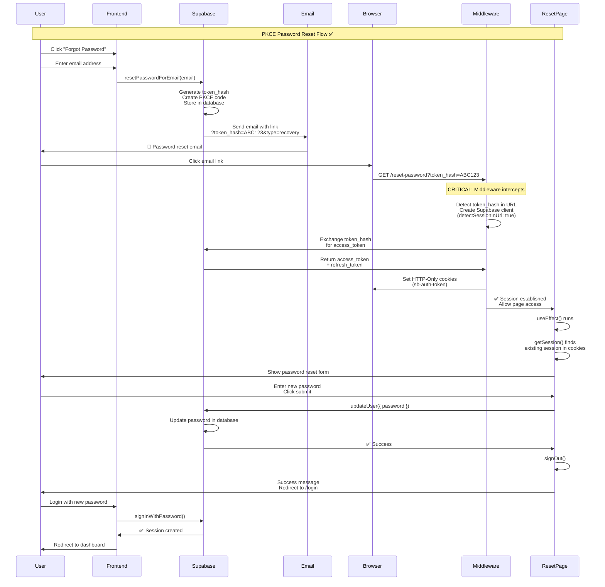

# 🔐 Password Reset Flow (PKCE)

## Complete Flow Diagram



## Step-by-Step Breakdown

### 1️⃣ User Requests Password Reset
```
User clicks "Forgot Password" → Enters email → Frontend calls:
supabase.auth.resetPasswordForEmail(email)
```

### 2️⃣ Supabase Generates Token
```
- Creates token_hash (secure, one-time use)
- Generates PKCE code verifier
- Stores in database with expiry
```

### 3️⃣ Email Sent with Link
```
Email contains:
https://yourapp.com/reset-password?token_hash=ABC123&type=recovery
                                   ↑
                              Query parameter (server-visible)
```

### 4️⃣ Middleware Intercepts (CRITICAL!)
```javascript
// middleware.ts
const supabase = createServerClient({
  detectSessionInUrl: true,  // ← Enables PKCE exchange
  flowType: 'pkce'
});

await supabase.auth.getUser(); // ← Automatically exchanges token_hash
```

**What happens:**
- Middleware sees `?token_hash=ABC123` in URL
- Exchanges token_hash with Supabase server
- Receives access_token + refresh_token
- Sets HTTP-Only cookies automatically
- ✅ Session is established before page loads

### 5️⃣ Reset Page Loads with Session
```javascript
// Page already has session from middleware
const { data: { session } } = await supabase.auth.getSession();
// session exists! Show form.
```

### 6️⃣ User Updates Password
```javascript
await supabase.auth.updateUser({
  password: newPassword
});
// Password updated in database
```

### 7️⃣ Sign Out & Redirect
```javascript
await supabase.auth.signOut();
router.push('/login');
// User logs in with new password
```

## Key Points

### ✅ Why PKCE Works
- **Token in query params** (`?token_hash=`) → Server sees it
- **Server-side exchange** → Secure, automatic
- **HTTP-Only cookies** → Protected from XSS
- **One-time use** → Cannot be replayed

### 🔒 Security Features
```
1. Token Hash (not actual token)
2. PKCE code verifier (prevents interception)
3. HTTP-Only cookies (JavaScript can't access)
4. Secure flag (HTTPS only in production)
5. SameSite=Lax (CSRF protection)
6. Short expiry (1 hour)
```

### 🎯 Critical Configuration

**Supabase Dashboard:**
```
Authentication → URL Configuration:
- Site URL: https://yourapp.com
- Redirect URLs: https://yourapp.com/reset-password

Authentication → Email Templates:
- Confirm signup: {{ .SiteURL }}/reset-password?token_hash={{ .TokenHash }}&type=recovery
```

**Middleware:**
```typescript
createServerClient(supabaseUrl, supabaseKey, {
  cookies: { /* cookie handlers */ },
  detectSessionInUrl: true,  // Must be true!
  flowType: 'pkce'           // Must be 'pkce'!
})
```

## Timeline

```
0.0s  → User clicks email link
0.1s  → Browser navigates to /reset-password?token_hash=...
0.2s  → Server receives request WITH token_hash ✅
0.3s  → Middleware intercepts, detects token_hash
0.5s  → Middleware exchanges token → gets access_token
0.7s  → HTTP-Only cookies set
0.8s  → Page renders with valid session
1.0s  → ✅ Form appears, ready for password reset
```