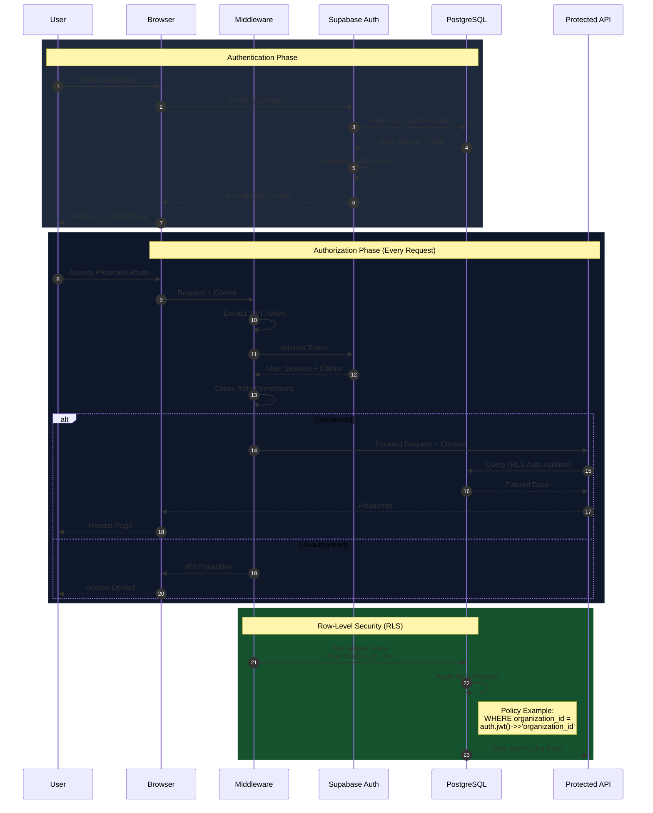

### 🔐 Security & Authentication Flow

```mermaid
sequenceDiagram
    autonumber
    participant User
    participant Browser
    participant MW as Middleware
    participant Auth as Supabase Auth
    participant DB as PostgreSQL
    participant API as Protected API

    rect rgb(30, 41, 59)
    Note over User,DB: Authentication Phase
    User->>Browser: Enter Credentials
    Browser->>Auth: POST /auth/login
    Auth->>DB: Verify User (profiles table)
    DB-->>Auth: User Record + Role
    Auth->>Auth: Generate JWT Token
    Auth-->>Browser: Set httpOnly Cookie
    Browser-->>User: Redirect to Dashboard
    end

    rect rgb(15, 23, 42)
    Note over Browser,API: Authorization Phase (Every Request)
    User->>Browser: Access Protected Route
    Browser->>MW: Request + Cookie
    MW->>MW: Extract JWT Token
    MW->>Auth: Validate Token
    Auth-->>MW: User Session + Claims
    MW->>MW: Check Role Permissions
    alt Authorized
        MW->>API: Forward Request + Context
        API->>DB: Query (RLS Auto-Applied)
        DB-->>API: Filtered Data
        API-->>Browser: Response
        Browser-->>User: Render Page
    else Unauthorized
        MW-->>Browser: 403 Forbidden
        Browser-->>User: Access Denied
    end
    end

    rect rgb(20, 83, 45)
    Note over MW,DB: Row-Level Security (RLS)
    MW->>DB: Set session vars<br/>organization_id, role
    DB->>DB: Apply RLS Policies
    Note right of DB: Policy Example:<br/>WHERE organization_id = <br/>auth.jwt()->>'organization_id'
    DB-->>API: Only User's Org Data
    end
```