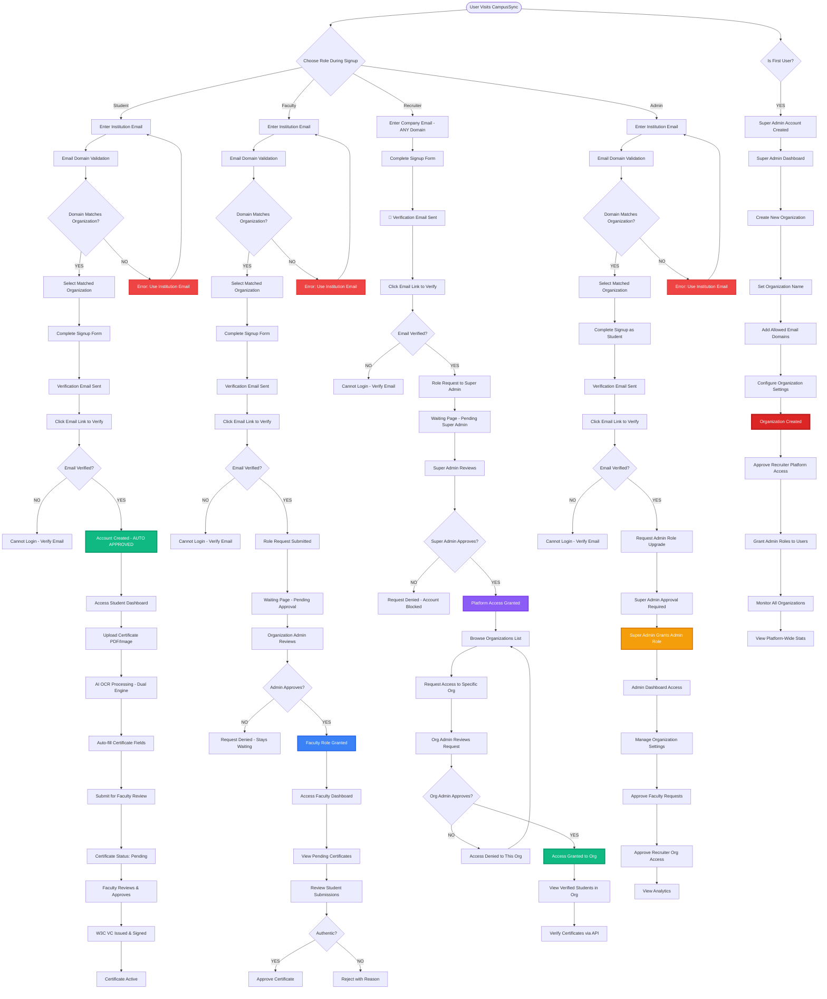

### 📋User Journey Flow 

```mermaid
graph TB
    Start([User Visits CampusSync]) --> Role{Choose Role During Signup}
    
    %% STUDENT FLOW - Students CANNOT create orgs, must use institution email
    Role -->|Student| S1[Enter Institution Email]
    S1 --> S2[Email Domain Validation]
    S2 --> S3{Domain Matches Organization?}
    S3 -->|YES| S4[Select Matched Organization]
    S3 -->|NO| S_ERR[ Error: Use Institution Email]
    S_ERR --> S1
    S4 --> S5[Complete Signup Form]
    S5 --> S5A[ Verification Email Sent]
    S5A --> S5B[Click Email Link to Verify]
    S5B --> S5C{Email Verified?}
    S5C -->|NO| S5D[ Cannot Login - Verify Email]
    S5C -->|YES| S6[Account Created - AUTO APPROVED]
    S6 --> S7[Access Student Dashboard]
    S7 --> S8[Upload Certificate PDF/Image]
    S8 --> S9[AI OCR Processing - Dual Engine]
    S9 --> S10[Auto-fill Certificate Fields]
    S10 --> S11[Submit for Faculty Review]
    S11 --> S12[Certificate Status: Pending]
    S12 --> S13[Faculty Reviews & Approves]
    S13 --> S14[W3C VC Issued & Signed]
    S14 --> S15[Certificate Active]
    
    %% FACULTY FLOW - Faculty CANNOT create orgs, needs admin approval
    Role -->|Faculty| F1[Enter Institution Email]
    F1 --> F2[Email Domain Validation]
    F2 --> F3{Domain Matches Organization?}
    F3 -->|YES| F4[Select Matched Organization]
    F3 -->|NO| F_ERR[ Error: Use Institution Email]
    F_ERR --> F1
    F4 --> F5[Complete Signup Form]
    F5 --> F5A[Verification Email Sent]
    F5A --> F5B[Click Email Link to Verify]
    F5B --> F5C{Email Verified?}
    F5C -->|NO| F5D[ Cannot Login - Verify Email]
    F5C -->|YES| F6[Role Request Submitted]
    F6 --> F7[ Waiting Page - Pending Approval]
    F7 --> F8[Organization Admin Reviews]
    F8 --> F9{Admin Approves?}
    F9 -->|NO| F10[Request Denied - Stays Waiting]
    F9 -->|YES| F11[Faculty Role Granted]
    F11 --> F12[Access Faculty Dashboard]
    F12 --> F13[View Pending Certificates]
    F13 --> F14[Review Student Submissions]
    F14 --> F15{Authentic?}
    F15 -->|YES| F16[Approve Certificate]
    F15 -->|NO| F17[Reject with Reason]
    
    %% RECRUITER FLOW - Recruiters use ANY email, need super admin + org admin approval
    Role -->|Recruiter| R1[Enter Company Email - ANY Domain ]
    R1 --> R2[Complete Signup Form]
    R2 --> R2A[📧 Verification Email Sent]
    R2A --> R2B[Click Email Link to Verify]
    R2B --> R2C{Email Verified?}
    R2C -->|NO| R2D[ Cannot Login - Verify Email]
    R2C -->|YES| R3[Role Request to Super Admin]
    R3 --> R4[ Waiting Page - Pending Super Admin]
    R4 --> R5[Super Admin Reviews]
    R5 --> R6{Super Admin Approves?}
    R6 -->|NO| R7[Request Denied - Account Blocked]
    R6 -->|YES| R8[Platform Access Granted]
    R8 --> R9[Browse Organizations List]
    R9 --> R10[Request Access to Specific Org]
    R10 --> R11[ Org Admin Reviews Request]
    R11 --> R12{Org Admin Approves?}
    R12 -->|NO| R13[Access Denied to This Org]
    R12 -->|YES| R14[Access Granted to Org]
    R14 --> R15[View Verified Students in Org]
    R15 --> R16[Verify Certificates via API]
    R13 --> R9
    
    %% ORGANIZATION ADMIN FLOW - Must be promoted by Super Admin
    Role -->|Admin| A1[Enter Institution Email]
    A1 --> A2[Email Domain Validation]
    A2 --> A3{Domain Matches Organization?}
    A3 -->|YES| A4[Select Matched Organization]
    A3 -->|NO| A_ERR[ Error: Use Institution Email]
    A_ERR --> A1
    A4 --> A5[Complete Signup as Student]
    A5 --> A5A[Verification Email Sent]
    A5A --> A5B[Click Email Link to Verify]
    A5B --> A5C{Email Verified?}
    A5C -->|NO| A5D[ Cannot Login - Verify Email]
    A5C -->|YES| A6[Request Admin Role Upgrade]
    A6 --> A7[ Super Admin Approval Required]
    A7 --> A8[Super Admin Grants Admin Role]
    A8 --> A9[Admin Dashboard Access]
    A9 --> A10[Manage Organization Settings]
    A10 --> A11[Approve Faculty Requests]
    A11 --> A12[Approve Recruiter Org Access]
    A12 --> A13[View Analytics]
    
    %% SUPER ADMIN FLOW - Platform creator, creates all organizations
    Start --> SA1{Is First User?}
    SA1 -->|YES| SA2[ Super Admin Account Created]
    SA2 --> SA3[Super Admin Dashboard]
    SA3 --> SA4[ Create New Organization]
    SA4 --> SA5[Set Organization Name]
    SA5 --> SA6[Add Allowed Email Domains]
    SA6 --> SA7[Configure Organization Settings]
    SA7 --> SA8[Organization Created ]
    SA8 --> SA9[Approve Recruiter Platform Access]
    SA9 --> SA10[Grant Admin Roles to Users]
    SA10 --> SA11[Monitor All Organizations]
    SA11 --> SA12[View Platform-Wide Stats]
    
    style S6 fill:#10b981,stroke:#059669,color:#fff,stroke-width:3px
    style F11 fill:#3b82f6,stroke:#2563eb,color:#fff,stroke-width:3px
    style R8 fill:#8b5cf6,stroke:#7c3aed,color:#fff,stroke-width:3px
    style R14 fill:#10b981,stroke:#059669,color:#fff,stroke-width:3px
    style A8 fill:#f59e0b,stroke:#d97706,color:#fff,stroke-width:3px
    style SA8 fill:#dc2626,stroke:#b91c1c,color:#fff,stroke-width:4px
    style S_ERR fill:#ef4444,stroke:#dc2626,color:#fff,stroke-width:2px
    style F_ERR fill:#ef4444,stroke:#dc2626,color:#fff,stroke-width:2px
    style A_ERR fill:#ef4444,stroke:#dc2626,color:#fff,stroke-width:2px
```